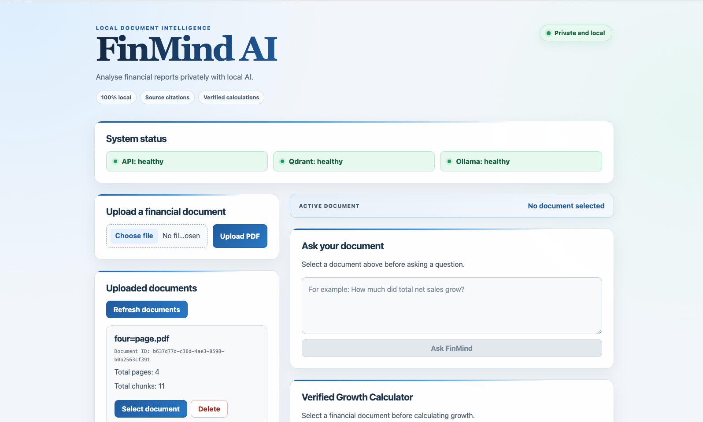
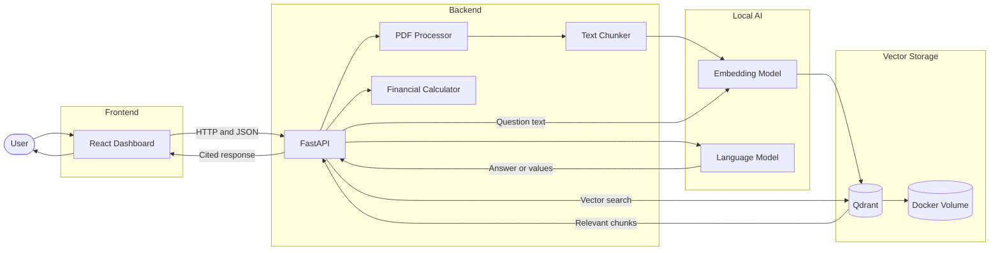
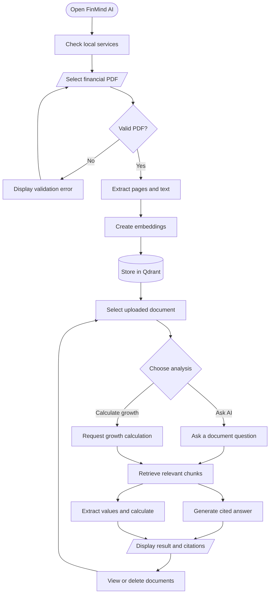
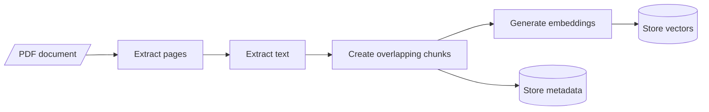
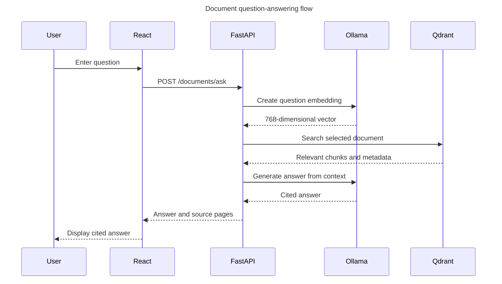
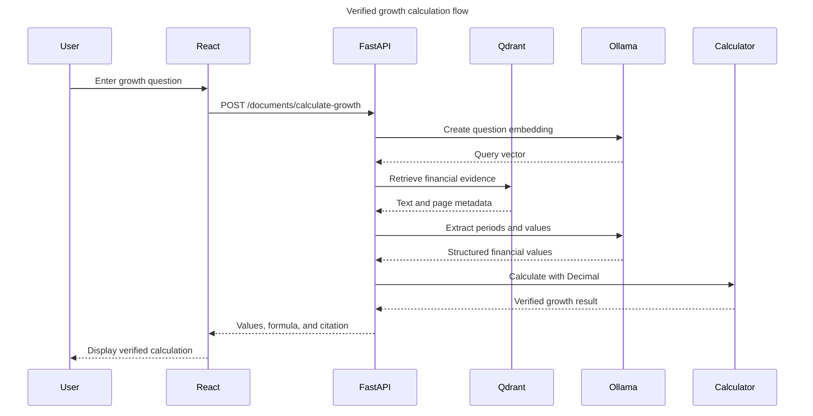

<div align="center">

# FinMind AI

### Local, privacy-focused financial document intelligence

Analyse financial reports with semantic search, page citations, local AI models, and verified financial calculations.


</div>

<p align="center">
  
</p>

<p align="center">
  <em>
    Local financial document analysis with semantic search,
    traceable citations, and deterministic calculations.
  </em>
</p>

---

## Overview

FinMind AI is a local-first financial document analysis application.

Users can upload a financial PDF, select the indexed document, ask natural-language questions, retrieve relevant evidence, generate answers with page citations, and calculate verified financial growth.

The application uses retrieval-augmented generation rather than sending an entire document directly to a language model.

Financial arithmetic is not delegated to the LLM. The model extracts structured values, Pydantic validates them, and Python performs the final calculation using `Decimal`.

## Engineering highlights

- Local-first architecture designed for document privacy
- Retrieval-augmented generation with document-level filtering
- Page-level citations for answer traceability
- Structured LLM output validated with Pydantic
- Financial calculations performed using Python `Decimal`
- 768-dimensional semantic embeddings
- Persistent Qdrant storage managed through Docker Compose
- Automated API, workflow, validation, and unit tests
- Environment-based backend and frontend configuration
- Responsive React dashboard
- Explicit loading, validation, and failure states
- Generated OpenAPI documentation through FastAPI

## Features

### Document management

- Upload text-based PDF documents
- Validate file type and empty files
- Extract text page by page
- Split extracted text into overlapping chunks
- Generate document and chunk identifiers
- Store page and source metadata
- List indexed documents
- Select an active document
- Delete documents and their stored vectors

### AI document analysis

- Generate embeddings locally with Ollama
- Store and retrieve vectors through Qdrant
- Filter retrieval by `document_id`
- Ask natural-language questions
- Generate context-based answers
- Return page-level citations
- Deduplicate repeated sources

### Verified calculations

- Retrieve relevant financial evidence
- Extract structured periods and values
- Validate extracted data with Pydantic
- Calculate absolute change using Python
- Calculate percentage change using Python
- Use exact decimal arithmetic
- Return the formula and source page

### Reliability

- Health checks for FastAPI, Qdrant, and Ollama
- Automated API tests
- Unit tests for text chunking
- Unit tests for financial calculations
- Mocked workflow tests
- Request and file validation
- Frontend lint validation

---

## System architecture



---

## User workflow



---

## Document-processing pipeline



Each stored chunk includes:

```json
{
  "document_id": "unique-document-id",
  "chunk_index": 0,
  "text": "Extracted financial text",
  "character_count": 956,
  "metadata": {
    "page_number": 1,
    "page_chunk_index": 0,
    "source": "financial-report.pdf"
  }
}
```

---

## Question-answering sequence



---

## Verified financial calculation



### Calculation design

The language model does not perform the final arithmetic.

The calculation flow is:

```text
Retrieved document evidence
→ structured LLM extraction
→ Pydantic validation
→ Decimal conversion
→ Python calculation
→ result with citation
```

Formula:

```text
percentage_change =
(current_value - previous_value) / previous_value × 100
```

Example:

```text
Previous period: 2024
Current period: 2025
Previous value: 391035
Current value: 416161
Absolute change: 25126
Percentage change: 6.43%
Citation: Page 1
```

---

## Technology stack

### Backend

| Technology | Purpose |
|---|---|
| Python 3.12 | Backend language |
| FastAPI | REST API and OpenAPI documentation |
| Uvicorn | ASGI development server |
| Pydantic | Request and structured-output validation |
| pypdf | PDF text extraction |
| python-dotenv | Environment configuration |
| pytest | Automated testing |

### Frontend

| Technology | Purpose |
|---|---|
| React | User interface |
| Vite | Development server and production build |
| JavaScript | Frontend application logic |
| CSS | Responsive dashboard design |
| ESLint | Static code analysis |

### AI and data

| Technology | Purpose |
|---|---|
| Ollama | Local model runtime |
| `nomic-embed-text` | 768-dimensional embeddings |
| `qwen3:4b-instruct` | Answers and structured extraction |
| Qdrant | Vector database |
| Docker Compose | Qdrant container management |
| Docker volume | Persistent vector storage |

---

## Project structure

```text
FinMind-AI/
├── backend/
│   ├── main.py
│   └── services/
│       ├── embedding_service.py
│       ├── financial_calculator.py
│       ├── llm_service.py
│       ├── text_chunker.py
│       └── vector_store.py
│
├── frontend/
│   ├── src/
│   │   ├── components/
│   │   │   ├── AskDocument.jsx
│   │   │   ├── DocumentList.jsx
│   │   │   ├── DocumentUpload.jsx
│   │   │   ├── GrowthCalculator.jsx
│   │   │   └── HealthStatus.jsx
│   │   ├── App.jsx
│   │   ├── App.css
│   │   ├── config.js
│   │   └── index.css
│   ├── .env.example
│   └── package.json
│
├── tests/
│   ├── test_api.py
│   ├── test_document_workflow.py
│   ├── test_financial_calculator.py
│   └── test_text_chunker.py
│
├── docs/
│   └── images/
│       └── finmind-dashboard.png
│
├── .env.example
├── compose.yaml
├── requirements.txt
└── README.md
```

---

## Prerequisites

Install the following software:

- Python 3.12 or newer
- Node.js 20.19 or newer
- Docker Desktop
- Ollama
- Git

---

## Local installation

### 1. Clone the repository

```bash
git clone https://github.com/AbuBakerAttique/FinMind-AI.git
cd FinMind-AI
```

### 2. Create the Python environment

```bash
python3.12 -m venv .venv
source .venv/bin/activate
```

Install dependencies:

```bash
python -m pip install --upgrade pip
python -m pip install -r requirements.txt
```

### 3. Configure the backend

```bash
cp .env.example .env
```

Default configuration:

```env
QDRANT_URL=http://localhost:6333
OLLAMA_URL=http://localhost:11434
```

### 4. Start Qdrant

Start Docker Desktop.

Create the persistent volume if it does not already exist:

```bash
docker volume create finmind_qdrant_data
```

Start Qdrant:

```bash
docker compose up -d
```

Check its status:

```bash
docker compose ps
```

Qdrant dashboard:

```text
http://localhost:6333/dashboard
```

### 5. Install the Ollama models

```bash
ollama pull nomic-embed-text
ollama pull qwen3:4b-instruct
```

Confirm the models are installed:

```bash
ollama list
```

### 6. Start the backend

```bash
python -m uvicorn backend.main:app --reload
```

Backend API:

```text
http://localhost:8000
```

Swagger documentation:

```text
http://localhost:8000/docs
```

Health endpoint:

```text
http://localhost:8000/health
```

### 7. Configure the frontend

Open another terminal:

```bash
cd frontend
cp .env.example .env
npm install
```

Default frontend configuration:

```env
VITE_API_URL=http://localhost:8000
```

### 8. Start the frontend

```bash
npm run dev
```

Frontend:

```text
http://localhost:5173
```

---

## API endpoints

| Method | Endpoint | Purpose |
|---|---|---|
| `GET` | `/` | Return the backend status message |
| `GET` | `/health` | Check FastAPI, Qdrant, and Ollama |
| `POST` | `/documents/upload` | Upload and index a PDF |
| `GET` | `/documents` | List indexed documents |
| `DELETE` | `/documents/{document_id}` | Delete a document and its vectors |
| `POST` | `/documents/search` | Search relevant document chunks |
| `POST` | `/documents/ask` | Generate a cited answer |
| `POST` | `/calculations/growth` | Calculate growth from supplied values |
| `POST` | `/documents/calculate-growth` | Extract and calculate document growth |

Interactive API documentation is available at:

```text
http://localhost:8000/docs
```

---

## Running automated tests

Activate the virtual environment:

```bash
source .venv/bin/activate
```

Run the complete backend test suite:

```bash
python -m pytest -v
```

The tests cover:

- Root endpoint
- Health endpoint
- Qdrant failure state
- Ollama failure state
- Invalid file types
- Empty PDFs
- Missing request fields
- Text chunking
- Chunk overlap
- Financial growth
- Negative growth
- Decimal rounding
- Division-by-zero protection
- Mocked PDF processing
- Document listing
- Document deletion
- Semantic search workflow
- Answer generation
- Citation deduplication

External Ollama and Qdrant operations are mocked in workflow tests, preventing changes to real stored data.

---

## Frontend quality checks

Run ESLint:

```bash
cd frontend
npm run lint
```

Create an optimized production build:

```bash
npm run build
```

The production files are generated inside:

```text
frontend/dist/
```

---

## Starting the project later

### Terminal 1: Qdrant

```bash
docker compose up -d
```

### Terminal 2: Backend

```bash
source .venv/bin/activate
python -m uvicorn backend.main:app --reload
```

### Terminal 3: Frontend

```bash
cd frontend
npm run dev
```

Make sure Ollama is running before using embeddings or AI answers.

---

## Stopping the project

Stop FastAPI and React using `Control + C` in their terminals.

Stop Qdrant while preserving its data:

```bash
docker compose stop
```

Restart it later:

```bash
docker compose start
```

---

## Privacy and data handling

FinMind AI is designed for local document processing:

- Qdrant runs locally through Docker.
- Ollama models run locally.
- PDF text is processed by the local backend.
- Embeddings are generated locally.
- Vectors and metadata remain in a local Docker volume.
- No paid cloud-model API is required.
- Local `.env` configuration files are excluded from Git.

Do not upload confidential or personally identifiable documents to a public demonstration repository or public screenshot.

---

## Design decisions

### Why retrieval-augmented generation?

A financial report can contain more text than a language model should receive in one prompt. Retrieval selects only the chunks most relevant to the user’s question.

### Why document-level filtering?

Every vector contains a `document_id`. Search results are filtered using that identifier, preventing chunks from unrelated documents from entering the answer context.

### Why page metadata?

Page numbers allow the frontend to show citations and let users verify an answer against the original document.

### Why Python `Decimal`?

Binary floating-point arithmetic can introduce small numerical inaccuracies. Financial calculations use `Decimal` for predictable precision and rounding.

### Why separate embedding and language models?

Embedding models represent semantic meaning numerically. Language models generate text and structured information. Each model is used for the task it is designed to perform.

---

## Current limitations

- Text extraction currently supports text-based PDFs.
- Scanned PDFs require OCR, which is not yet implemented.
- Complex tables may lose some structure during PDF extraction.
- Retrieval quality depends on the quality of extracted text.
- The project currently targets local single-user operation.
- Authentication and authorization are not implemented.
- The application has not been positioned as a regulated financial-advice system.

---

## Future improvements

- OCR support for scanned documents
- Table-aware financial extraction
- Retrieved-chunk reranking
- Multi-document comparison
- Conversation history
- Exportable analysis reports
- Authentication and user workspaces
- Frontend component tests
- Continuous integration with GitHub Actions
- Deployment profiles for supported environments

---

## Responsible use

FinMind AI is a document-analysis and educational engineering project. Generated answers should be verified against the cited source pages before being used for financial decisions.

---

## Author

**Abu Bakar Attique**

GitHub: [AbuBakerAttique](https://github.com/AbuBakerAttique)

---

<div align="center">

Built with Python, FastAPI, React, Ollama, Qdrant, and Docker.

</div>