# FinMind AI

A privacy-focused financial document intelligence application that runs locally. FinMind AI extracts text from PDF reports, creates semantic embeddings, stores them in a vector database, retrieves relevant evidence, and generates cited answers using local AI models.

The project also includes a verified financial growth calculator that uses an LLM for structured value extraction and Python `Decimal` arithmetic for reliable calculations.

## Features

- Upload and process financial PDF documents
- Extract text page by page
- Split text into overlapping semantic chunks
- Generate 768-dimensional embeddings locally
- Store and search vectors using Qdrant
- Ask natural-language questions about a selected document
- Generate answers using a local language model
- Return page-level source citations
- Calculate verified financial growth
- List, select, and delete uploaded documents
- Monitor FastAPI, Qdrant, and Ollama health
- Responsive React dashboard
- Automated API and business-logic tests
- Environment-based configuration
- Persistent Qdrant storage through Docker Compose

## Architecture

```mermaid
flowchart LR
    User[User] --> React[React frontend]
    React --> FastAPI[FastAPI backend]

    FastAPI --> PDF[PDF extraction]
    PDF --> Chunks[Text chunking]
    Chunks --> Embeddings[Ollama embedding model]
    Embeddings --> Qdrant[(Qdrant vector database)]

    React --> Question[User question]
    Question --> FastAPI
    FastAPI --> QueryEmbedding[Question embedding]
    QueryEmbedding --> Qdrant
    Qdrant --> Context[Relevant document chunks]
    Context --> LLM[Ollama language model]
    LLM --> Answer[Cited answer]

    Context --> Extraction[Structured value extraction]
    Extraction --> Calculator[Python Decimal calculation]
    Calculator --> Verified[Verified growth result]
```



## Document-processing pipeline

```text
PDF
→ pages
→ extracted text
→ overlapping chunks
→ 768-dimensional embeddings
→ Qdrant vectors and metadata
```

## Question-answering pipeline

```text
Question
→ question embedding
→ Qdrant similarity search
→ relevant document chunks
→ local language model
→ answer with page citations
```

## Technology stack

### Backend

- Python 3.12
- FastAPI
- Uvicorn
- Pydantic
- pypdf
- python-dotenv
- pytest

### Frontend

- React
- Vite
- JavaScript
- CSS
- ESLint

### AI and storage

- Ollama
- `nomic-embed-text` embedding model
- `qwen3:4b-instruct` language model
- Qdrant vector database
- Docker and Docker Compose

## Why Qdrant?

Qdrant stores document chunks together with their embeddings and metadata.

Each stored point contains:

- A unique point ID
- A 768-dimensional vector
- Document ID
- Chunk index
- Extracted text
- Page number
- Source filename

When a user asks a question, FinMind AI creates an embedding for the question and asks Qdrant to retrieve the most semantically similar chunks from the selected document.

## Why Ollama?

Ollama runs the AI models locally.

FinMind AI uses two model types:

- `nomic-embed-text` converts text into numerical vectors.
- `qwen3:4b-instruct` generates answers and extracts structured financial values.

Document context is processed locally rather than being sent to a paid cloud-model API.

## Verified financial calculations

The language model does not perform the final arithmetic.

Instead:

1. The model extracts the metric, periods, values, unit, and page number.
2. Pydantic validates the structured response.
3. Python converts values to `Decimal`.
4. Python calculates the absolute and percentage change.
5. The API returns the values, formula, result, and citation.

Formula:

```text
percentage_change =
(current_value - previous_value) / previous_value × 100
```

## Project structure

```text
FinMind AI/
├── backend/
│   ├── main.py
│   └── services/
│       ├── embedding_service.py
│       ├── financial_calculator.py
│       ├── llm_service.py
│       ├── text_chunker.py
│       └── vector_store.py
├── frontend/
│   ├── src/
│   │   ├── components/
│   │   │   ├── AskDocument.jsx
│   │   │   ├── DocumentList.jsx
│   │   │   ├── DocumentUpload.jsx
│   │   │   ├── GrowthCalculator.jsx
│   │   │   └── HealthStatus.jsx
│   │   ├── App.jsx
│   │   ├── App.css
│   │   ├── config.js
│   │   └── index.css
│   ├── .env.example
│   └── package.json
├── tests/
│   ├── test_api.py
│   ├── test_document_workflow.py
│   ├── test_financial_calculator.py
│   └── test_text_chunker.py
├── .env.example
├── compose.yaml
├── requirements.txt
└── README.md
```

## Prerequisites

Install:

- Python 3.12 or newer
- Node.js 20.19 or newer
- Docker Desktop
- Ollama
- Git

## Local installation

### 1. Clone the repository

```bash
git clone https://github.com/AbuBakerAttique/FinMind-AI.git
cd FinMind-AI
```

### 2. Create the Python environment

```bash
python3.12 -m venv .venv
source .venv/bin/activate
```

Install backend dependencies:

```bash
python -m pip install --upgrade pip
python -m pip install -r requirements.txt
```

### 3. Configure the backend

```bash
cp .env.example .env
```

Default configuration:

```env
QDRANT_URL=http://localhost:6333
OLLAMA_URL=http://localhost:11434
```

### 4. Start Qdrant

Make sure Docker Desktop is running, then run:

```bash
docker compose up -d
```

Check its status:

```bash
docker compose ps
```

Qdrant dashboard:

```text
http://localhost:6333/dashboard
```

### 5. Install the Ollama models

```bash
ollama pull nomic-embed-text
ollama pull qwen3:4b-instruct
```

Confirm that Ollama is running:

```bash
ollama list
```

### 6. Start the backend

```bash
python -m uvicorn backend.main:app --reload
```

Backend:

```text
http://localhost:8000
```

API documentation:

```text
http://localhost:8000/docs
```

Health endpoint:

```text
http://localhost:8000/health
```

### 7. Configure and start the frontend

Open another terminal:

```bash
cd frontend
cp .env.example .env
npm install
npm run dev
```

Frontend:

```text
http://localhost:5173
```

## API endpoints

| Method | Endpoint | Purpose |
|---|---|---|
| `GET` | `/` | Backend status message |
| `GET` | `/health` | Check API, Qdrant, and Ollama |
| `POST` | `/documents/upload` | Upload and index a PDF |
| `GET` | `/documents` | List stored documents |
| `DELETE` | `/documents/{document_id}` | Delete a document |
| `POST` | `/documents/search` | Search relevant chunks |
| `POST` | `/documents/ask` | Generate a cited answer |
| `POST` | `/calculations/growth` | Calculate growth from supplied values |
| `POST` | `/documents/calculate-growth` | Extract and calculate document growth |

## Example question

```text
How much did total net sales grow from 2024 to 2025?
```

Example verified result:

```text
Previous period: 2024
Current period: 2025
Previous value: 391035
Current value: 416161
Absolute change: 25126
Percentage change: 6.43%
Citation: Page 1
```

## Running the tests

Activate the Python virtual environment and run:

```bash
python -m pytest -v
```

The automated test suite covers:

- Root and health endpoints
- Qdrant and Ollama failure states
- File validation
- Request validation
- Text chunking and overlap
- Decimal financial calculations
- Mocked PDF processing
- Document listing and deletion
- Semantic-search workflow
- Answer generation and citation deduplication

## Frontend code quality

Run ESLint:

```bash
cd frontend
npm run lint
```

Create a production build:

```bash
npm run build
```

## Stopping the application

Stop FastAPI and React using `Control + C` in their terminals.

Stop Qdrant:

```bash
docker compose stop
```

Restart it later:

```bash
docker compose start
```

## Privacy

FinMind AI is designed for local document processing:

- Qdrant runs locally through Docker.
- Ollama models run locally.
- PDF text and vectors remain on the local machine.
- Local configuration files are excluded from Git.
- No paid cloud-model API is required.

Do not upload confidential or personally identifiable documents to a public demonstration repository.

## Current limitations

- Text extraction works with text-based PDFs.
- Scanned documents require an OCR feature that is not yet implemented.
- Retrieval quality depends on PDF structure and extracted text quality.
- The application currently runs as a local development project.
- Authentication and multi-user access are not yet implemented.

## Future improvements

- OCR support for scanned financial reports
- Reranking retrieved chunks
- Table-aware financial extraction
- Multiple-document comparison
- Conversation history
- Exportable analysis reports
- Authentication and user workspaces
- Deployment configuration